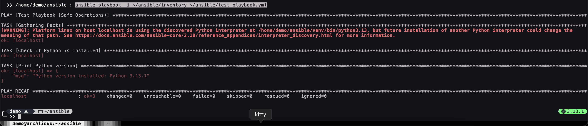
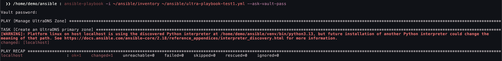
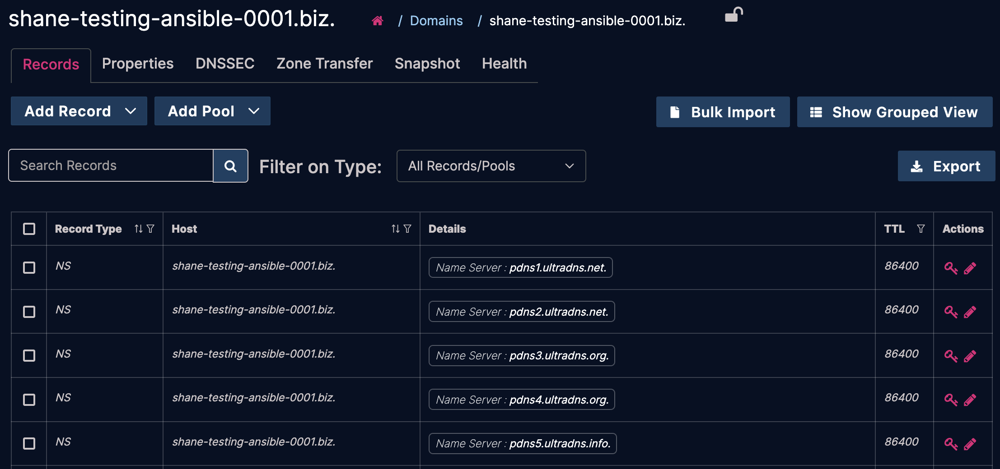

# Getting Started

## Setup Ansible

It is recommended to install `ansible` and `requests` using `pip` inside a Python virtual environment (`venv`).

```bash
mkdir ~/ansible && cd ~/ansible
python3 -m venv venv
source venv/bin/activate
pip3 install ansible requests
```

### Create an Inventory File

Create a simple inventory file and define `localhost` as the managed host:

```bash
echo -e "[test_servers]\nlocalhost ansible_connection=local" > ~/ansible/inventory
```

### Test Connectivity

Run the following command to verify that Ansible can communicate with your test machine:

```bash
ansible -i ~/ansible/inventory test_servers -m ping
```

#### Expected Output

```javascript
localhost | SUCCESS => {
    "changed": false,
    "ping": "pong"
}

```

If you see a timeout or authentication error, check your SSH settings (not applicable here since we’re using `localhost`).

### Test Playbook

[Provided is a simple test playbook that prints the currently installed Python version.](./test-playbook.yml)

Save this file to your Ansible directory (`~/ansible`), then run:

```bash
ansible-playbook -i ~/ansible/inventory ~/ansible/test-playbook.yml
```

#### Expected Output



---

## Install the UltraDNS Collection

To install the UltraDNS collection, run:

```bash
ansible-galaxy collection install ultradns.ultradns
```

### Store Your Credentials in Ansible Vault

To securely store your UltraDNS credentials, create a **vault-protected** YAML file:

```bash
ansible-vault create ~/ansible/ultra_vault.yml
```

You'll be prompted to set a password. Once set, a text editor will open (e.g., `nano` or `vim`). Enter the following:

```yaml
ultra_provider:
  use_test: false
  username: "<your UltraDNS username>"
  password: "<your UltraDNS password>"
```

Replace the `<your UltraDNS username>` and `<your UltraDNS password>` with your actual credentials, then save and exit the editor.

### Test UltraDNS Integration

The `create-zone.yml` [playbook](./create-zone.yml) will attempt to create a test DNS zone, verifying that authentication via Ansible Vault works correctly.

Save this then run:

```bash
ansible-playbook -i ~/ansible/inventory ~/ansible/create-zone.yml --ask-vault-pass
```

Enter your vault password when prompted.

#### Expected Output



You should also see the newly created zone in the UltraDNS user interface.

