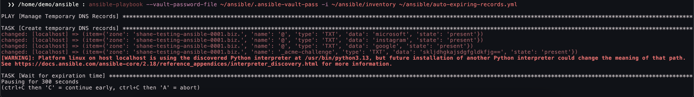
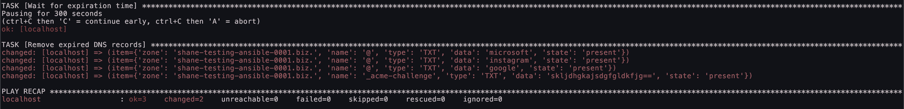

# Auto-Expiring Records Playbook

Some services, particularly those requiring domain validation, require temporary DNS records (e.g., TXT records with validation tokens). While some of these records are only needed for a short time, **others may be checked periodically by the service provider**. It’s best to consult the service’s documentation before assuming that a validation record can be safely removed.

This playbook automates the lifecycle of temporary DNS records by creating them and then removing them after a pre-defined **expiration** time. This prevents unnecessary clutter in your zone and reduces the risk of forgotten records lingering indefinitely.

## Records File

The records and expiration time are configured in `records.yml`.

## Running the Playbook

Once executed, the playbook provisions the records:

Then it waits for the `expire` duration before automatically removing them:

## Thoughts About Long Expiry Times

The current playbook is well-suited for short-lived records (minutes to hours) since it waits for the expiration time before removing them. However, for records that need to expire over days or weeks, keeping the playbook running is inefficient.

A better approach for long-lived records would be to decouple record creation from deletion using a scheduled process. This could be achieved by splitting the logic into two playbooks and introducing a lightweight task-tracking system.

### Alternative Approach

Instead of keeping an Ansible process running indefinitely, consider breaking it down into three steps:

1. **Record Creation Playbook**
	* Creates the records
	* Logs an expiration timestamp and a unique task ID in a database
2. **Scheduled Expiry Checker**
	* Runs periodically (via cron or a scheduled job inside a container)
	* Queries a task database to check for expired records
3. **Record Cleanup Playbook**
	* Removes expired records
	* Deletes the corresponding task ID from the database

This approach enables automation of record expiration without keeping Ansible running.