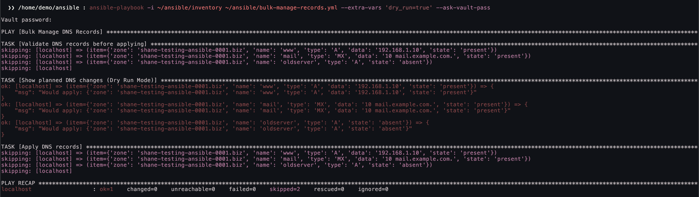
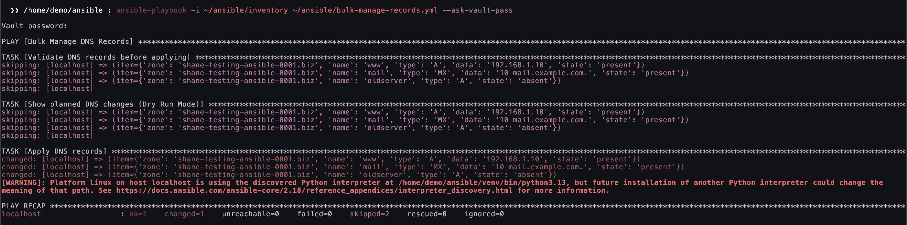
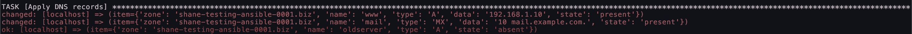

# Bulk Record Management Playbook

This playbook validates and applies DNS record changes to UltraDNS. It supports:

* Dry-run mode to preview changes before applying them.
* Automatic batch record creation, updates, and deletions.
* Custom default TTL values.

## Defining Your DNS Records

Records are stored in `records.yml`. The [provided example](./records.yml) defines two new records and removes an old record.

## Running the Playbook

### Preview Changes with Dry-Run Mode

Before applying changes, preview them using the dry-run mode.

```bash
ansible-playbook -i ~/ansible/inventory ~/ansible/bulk-manage-records.yml --extra-vars 'dry_run=true' --ask-vault-pass
```

This will output what changes would be made without modifying any records.



### Apply Changes

To apply the changes for real, run the playbook without `dry_run=true`:

```bash
ansible-playbook -i ~/ansible/inventory ~/ansible/bulk-manage-records.yml --ask-vault-pass
```



### Customizing the Default TTL

By default, records use a TTL of 300 seconds. You can override this using the `default_ttl` variable.

```bash
ansible-playbook -i ~/ansible/inventory ~/ansible/bulk-manage-records.yml --extra-vars 'default_ttl=600' --ask-vault-pass
```

Rerunning the playbook updates existing records to use the new TTL value.


