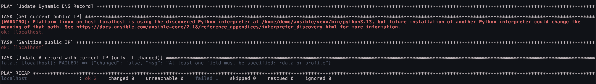
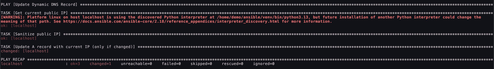

# DDNS Client Playbook

For dynamic environments such as home labs, self-hosted applications, or VPNs, you may need a playbook that updates an A record with your current public IP.

## Playbook Overview

Replace the `zone` field with your domain name and the `name` field with the **hostname** you want to update.

## How It Works

1. The playbook sends an HTTP request to `icanhazip.com`, which returns your public IP address.

	```bash
	  ❯❯ /home/demo/ansible : curl http://icanhazip.com
	45.45.45.45
	```

2. The retrieved IP address is trimmed to remove any whitespace or escape sequences.
3. The playbook then attempts to update the specified DNS record with the new public IP.

## Expected Behavior

### No IP Change

If the current IP matches the existing A record, the update step fails gracefully with `"changed": false"``. This is expected and prevents unnecessary updates.

#### Expected Output



### IP Changed

If the public IP differs from the existing A record, the DNS record is updated with the new IP.

#### Expected Output



## Setting Up A Scheduled Task

To make the DDNS client effective, it needs to run automatically at regular intervals to detect and update IP changes dynamically. Most Linux distributions come with crontab preinstalled, which we can use to schedule the playbook execution.

### Store the Vault Password

Since Ansible requires authentication to access UltraDNS, you'll need to store your vault password in a secure file:

```bash
echo "your_vault_password_here" > ~/ansible/.ansible-vault-pass
chmod 600 ~/ansible/.ansible-vault-pass
```

This ensures that only the file’s owner can read it.

### Automate the Playbook with Crontab

To run the playbook automatically, we need to edit the crontab:

```bash
crontab -e
```

This will open your default text editor. Add the following line:

```bash
* * * * * source ~/ansible/venv/bin/activate && ~/ansible/venv/bin/ansible-playbook --vault-password-file ~/ansible/.ansible-vault-pass -i ~/ansible/inventory ~/ansible/ddns-client.yml > ~/ansible/ddns.log 2>&1
```

#### Breaking Down the Cron Job

* `* * * * *` - Runs the playbook every minute. Adjust as needed (e.g., `*/5 * * * *` for every 5 minutes).
* `source ~/ansible/venv/bin/activate` - Activates the Python virtual environment where Ansible is installed.
* `~/ansible/venv/bin/ansible-playbook` - Runs Ansible from the virtual environment (ensures compatibility with installed dependencies).
* `--vault-password-file ~/ansible/.ansible-vault-pass` - Provides the stored vault password so Ansible can authenticate without user input.
* `-i ~/ansible/inventory ~/ansible/ddns-client.yml` - Specifies the inventory file and the DDNS playbook.
* `> ~/ansible/ddns.log 2>&1` _(Optional)_ - Redirects output and errors to `~/ansible/ddns.log` for debugging.

### Docker Deployment

You can find Docker setup instructions [here](./docker/README.md).
