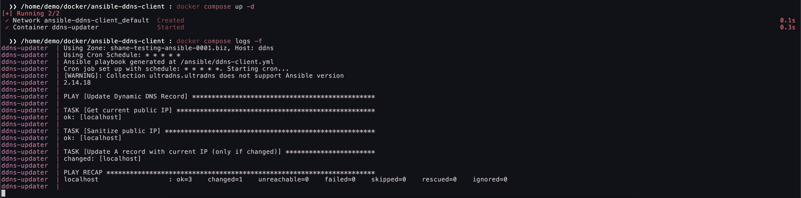

# Docker Deployment

If running the playbook in a cron job directly on your host machine isn't an option (i.e macOS or Windows) you can instead run it inside a lightweight Docker container. The following assumes you already have Docker installed with the Compose extension.

## Dockerfile

The [Dockerfile](./Dockerfile) sets up a minimal environment with Ansible, Python, `curl`, and `cron`.

## Entrypoint Script

The [entrypoint script](./entrypoint.sh):
* Automatically sets up Ansible in the container.
* Dynamically generates the playbook using environment variables (`ZONE`, `HOST`).
* Starts cron, running the playbook either once per minute or at a custom interval (`CRON_EXPRESSION`).

## Compose File

In the [compose file](./docker-compose.yml):

* `ZONE` is set to the domain (your DNS zone).
* `HOST` is the record name (the hostname that should be updated).
* `CRON_EXPRESSION` (optional) allows you to customize how often the playbook runs. By default, it runs every minute (`* * * * *`).
* The vault password file (`.ansible-vault-pass`) and UltraDNS credentials (`ultra_vault.yml`) are mounted as volumes, so the container can use them without storing sensitive information inside the image.

## Handling the Vault File

By default, the `.ansible-vault-pass` and `ultra_vault.yml` files must be created manually on the host machine before starting the container.

However, if you don’t want to generate them outside the container, you can log into the container (once running) and create them from within:

```bash
docker exec -it ddns-updater /bin/sh
```

Then, inside the container, create and edit your vault file:

```bash
ansible-vault create /ansible/ultra_vault.yml
```

This approach allows you to manage everything inside the container without needing Ansible installed on the host system.

## Running

Ensure you're in a directory where your `docker-compose.yml`, `entrypoint.sh` and your Dockerfile are located, then run:

```bash
docker compose up --build -d
```

To monitor the cron job execution in real-time:

```bash
docker compose logs -f
```



To stop the container:

```bash
docker compose down
```