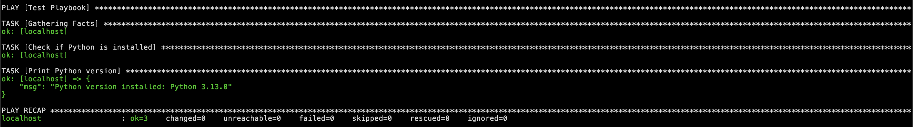
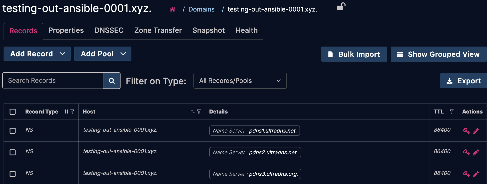

# Getting Started

## Setup Ansible

For testing, it is suggested to install `ansible` using `pip` inside a Python virtual environment (`venv`). In this guide, I'll create a self-contained Ansible test environment in a directory relative to my home folder called `sandbox/ansible-test-env`.

```bash
mkdir ~/sandbox/ansible-test-env && cd ~/sandbox/ansible-test-env
python -m venv venv
source venv/bin/activate
pip install ansible
```

_Note:_ There are many ways to install Ansible. You can install it system-wide using a package manager like `brew` or `apt`, or using `pipx`. This is just one approach intended primarily for development and to provide a clearer understanding of Ansible's ecosystem and file structure. Please refer to [Ansible's official community documentation](https://docs.ansible.com/ansible/latest/installation_guide/intro_installation.html) for a more detailed breakdown of options.

### Confirm the Install

Run the following commands to verify that Ansible has been installed.

```bash
ansible --version
ansible-community --version
```

Verify that these packages are installed in your Ansible test directory by checking their locations with `which`:

```bash
which ansible
which python
```

Take note of the path to your Python binary; you'll need it later.

### Initialize a Config File

Ansible provides several convenient `init` commands that can create scaffolds for roles and collections. Let's generate a basic configuration file:

```bash
ansible-config init --disabled > ansible.cfg
```

The `--disabled` switch indicates that everything will be commented out by default. We'll edit this file to adjust a few values as needed.

#### Inventory File Path

Find the following line:

```
# (pathlist) Comma-separated list of Ansible inventory sources
;inventory=/etc/ansible/hosts
```

Uncomment it and change the value to `hosts`:

```
inventory=hosts
```

This tells Ansible to use a file relative to its configuration file for the hosts configuration.

#### Roles Path

Next, find the following:

```
# (pathspec) Colon-separated paths in which Ansible will search for Roles.
;roles_path=/Users/sbarbett/.ansible/roles:/usr/share/ansible/roles:/etc/ansible/roles
```

Edit it to use a local directory by changing it to:

```
roles_path=roles
```

#### Collections Path

Search for this line:

```
# (pathspec) Colon-separated paths in which Ansible will search for collections content. Collections must be in nested *subdirectories*, not directly in these directories. For example, if ``COLLECTIONS_PATHS`` includes ``'{{ ANSIBLE_HOME ~ "/collections" }}'``, and you want to add ``my.collection`` to that directory, it must be saved as ``'{{ ANSIBLE_HOME} ~ "/collections/ansible_collections/my/collection" }}'``.

;collections_path=/Users/sbarbett/.ansible/collections:/usr/share/ansible/collections
```

Update the path to use a local directory:

```
collections_path=collections
```

#### Disable Host Key Checking

Finally, find this line:

```
# (boolean) Set this to "False" if you want to avoid host key checking by the underlying connection plugin Ansible uses to connect to the host.
# Please read the documentation of the specific connection plugin used for details.
;host_key_checking=True
```

Change it to disable host key checking (i.e. unwanted interactive prompts when creating `ssh` connections):

```
host_key_checking=False
```

### Create Folders and Inventory File

Create your `roles` and `collections` directories, and a simple inventory file defining `localhost` as the managed host:

```bash
mkdir roles collections
echo -e "[test_servers]\nlocalhost ansible_connection=local" > hosts
```

In Ansible, a host represents the context in which your plays execute. Typically this will be your `localhost`, but it can also be a remote server via SSH. Edit the `hosts` file to add the `ansible_python_interpreter` flag to `localhost`:

```
[test_servers]
localhost ansible_connection=local ansible_python_interpreter=<path_to_your_venv_python_binary>
```

Replace `<path_to_your_venv_python_binary>` with the output of `which python` from earlier. Although not strictly required (since Ansible auto-discovers your Python path), setting it avoids warning messages.

_Note:_ You can disable these Python discovery warnings in your config by setting `interpreter_python` to `auto_silent`.

#### Adding a Remote Host

While not required to follow along with this guide, if you want to add a remote host to your inventory, simply add a new line under the `[test_servers]` group:

```
remote_host ansible_host=<remote_host_ip_or_hostname> ansible_user=<ssh_username> ansible_ssh_private_key_file=<~/.ssh/your_key>
```

### Test Connectivity

Run the following command to verify that Ansible can communicate with your host(s):

```bash
ansible test_servers -m ping
```

#### Expected Output

For `localhost`:

```javascript
localhost | SUCCESS => {
    "changed": false,
    "ping": "pong"
}
```

For a remote host (if added):

```javascript
localhost | SUCCESS => {
    "changed": false,
    "ping": "pong"
}
remote_host | SUCCESS => {
    "ansible_facts": {
        "discovered_interpreter_python": "/usr/bin/python3.11"
    },
    "changed": false,
    "ping": "pong"
}
```

If you see a timeout or authentication error, check your SSH settings (not applicable when using `localhost`).

### Test Playbook

[This simple test playbook prints the currently installed Python version.](./playbooks/test-playbook.yml)

Create a directory named `playbooks`, save the file there, and then run:

```bash
ansible-playbook playbooks/test-playbook.yml
```

#### Expected Output



---

## Install the UltraDNS Collection

To install the UltraDNS collection, run:

```bash
ansible-galaxy collection install ultradns.ultradns
```

### Install `requests`

The UltraDNS plugins require the Python `requests` module. Install it using:

```bash
pip install requests
```

### Set Up a Directory for Variables

It's good practice to store your variables in a `group_vars` directory organized by group. Since the group in this guide is `test_servers`, create the directory as follows:

```bash
mkdir -p group_vars/test_servers
```

This is where you'll store your vault file and other variable files.

#### Test Variables

Create a file (e.g., `vars`) inside `group_vars/test_servers` with the following content:

```yaml
# Your UltraDNS account name
test_account_name: myaccount
# Some zones for testing (enter something unique here)
test_zone_name: testing-out-ansible-001.xyz
test_zone_name_2: testing-out-ansible-002.xyz
test_zone_name_3: testing-out-ansible-003.xyz
# A hostname (or owner name) to use in tests
test_host_name: test
# A test TTL value for records
test_ttl: 3600
```

### Store Your Credentials in Ansible Vault

To securely store your UltraDNS credentials, create a vault-protected file:

```bash
ansible-vault create group_vars/test_servers/vault
```

You'll be prompted to set a password. Once set, your text editor (e.g., `nano` or `vim`) will open. Enter the following content:

```yaml
ultra_provider:
  use_test: false
  username: "<your UltraDNS username>"
  password: "<your UltraDNS password>"
```

Replace the `<your UltraDNS username>` and `<your UltraDNS password>` with your actual credentials, then save and exit the editor.

_Note:_ If you want to use UltraDNS's controlled test environment (CTE), set `use_test` to `true`.

#### Creating a Password File for the Vault

When running playbooks that use vault data, you must either specify `--ask-vault-password` or `--vault-password-file`. The interactive prompt from `--ask-vault-password` isn't ideal for automation, so you might prefer storing the password in a file:

```bash
echo "your_vault_password_here" > ~/.vault-password
chmod 600 ~/.vault-password
```

It’s recommended that you keep this file outside your Ansible project directory to avoid accidentally committing it. You can then specify its location in your `ansible.cfg`:

```
# (path) The vault password file to use. Equivalent to ``--vault-password-file`` or ``--vault-id``.
# If executable, it will be run and the resulting stdout will be used as the password.
;vault_password_file=
```

### Test UltraDNS Integration

The `create-zone.yml` [playbook](./playbooks/create-zone.yml) attempts to create a test DNS zone, verifying that authentication via Ansible Vault is working correctly.

Save this in your `playbooks` directory and run:

```bash
ansible-playbook playbooks/create-zone.yml
```

#### Expected Output


You should also see the newly created zone in the UltraDNS user interface.



## Further Reading

For additional examples, refer to the [sample playbooks](./playbooks/README.md) documentation.