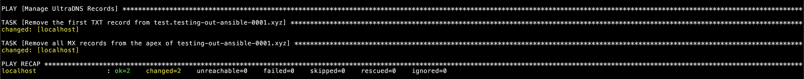
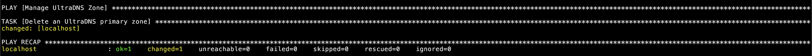
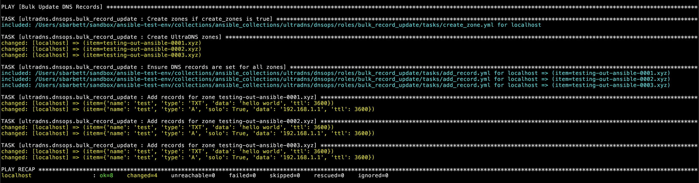
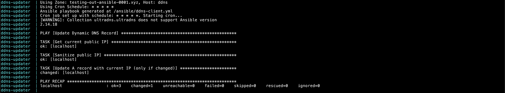
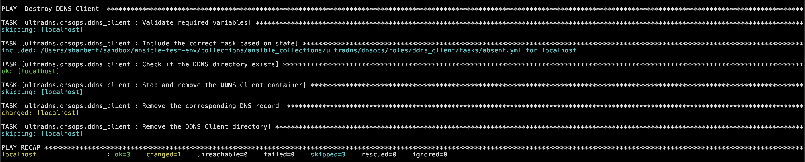
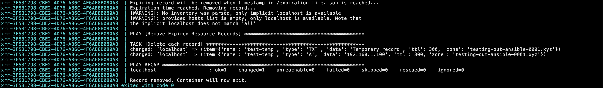
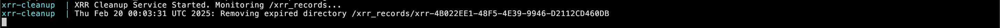

# Sample Playbooks

This section provides example playbooks demonstrating functionality beyond what was covered in the `test-playbook.yml` and `create-zone.yml` samples from the [Getting Started](../READNE.md) document.

## Create/Modify Records

This basic playbook creates a set of example records in your test zone. If records already exist, it will update them. Ansible refers to this behavior as idempotency, meaning the playbook converges the system to a desired state rather than running a series of imperative commands.

```bash
ansible-playbook playbooks/create-records.yml
```

### Example Output

[Screenshot of create-records.yml running](../img/ss4-19022025.png)

## Delete Records

This playbook will delete some records that were instantiated by `create-records.yml`.

```bash
ansible-playbook playbooks/delete-records.yml
```

### Example Output



## Delete Zone

Finally, delete the test zone.

```bash
ansible-playbook playbooks/delete-records.yml
```

### Example Output



## Using Roles

An Ansible role organizes tasks, variables, templates, and other components into a reusable structure. UltraDNS offers a collection of example roles in the `dnsops` collection under the `ultradns` namespace. ou can find the project on GitHub [here](https://github.com/ultradns/ultradns-ansible-roles). Install it from Ansible Galaxy with:

```bash
ansible-galaxy collection install ultradns.dnsops
```

The following examples demonstrate playbooks that use these roles.

### Bulk DNS Management

This role iterates through a list of zones and creates identical sets of resource records in each one.

```bash
ansible-playbook playbooks/bulk-record-management.yml
```

#### Example Output



### Create DDNS Client

The dynamic DNS client role deploys a Docker container onto your target host. The container runs in the background, periodically checking the public-facing IP address and synchronizing it with an A record on UltraDNS.

_Note:_ This role uses [Jeff Geerling's Docker role](https://galaxy.ansible.com/ui/standalone/roles/geerlingguy/docker/) to install Docker. If Docker is already installed on the target host, you can omit this step. Otherwise, install the standalone role:

```bash
ansible-galaxy role install geerlingguy.docker
```

Then run:

```bash
ansible-playbook playbooks/create-ddns.yml
```

In the `~/ddns_client` directory, view the client output using `docker compose logs`.

#### Example Output



### Remove DDNS Client

Running the following playbook will delete the dynamic DNS record, remove the Docker container, and delete the client's directory from the host.

```bash
ansible-playbook playbooks/delete-ddns.yml
```

#### Example Output



### Create Expiring Resource Record

An expiring resource record (XRR) or ephemeral record (e-record) is created with a future timestamp marker, after which it will delete itself. This utility is useful for certain types of domain control validation (DCV) records that are meant to be transitory but can sometimes be orphaned in a zone file.

_Note:_ Some service providers do periodic checks of DCV records, meaning they should not be deleted. It is best to consult with the service provider before making assumptions.

```bash
ansible-playbook playbooks/create-xrr.yml
```

#### Example Output

The container operates like an egg timer, remaining dormant until the timestamp has passed.


Then it deletes the record and exits.



A separate container monitors the XRR directory and cleans up old jobs by deleting their directories.

